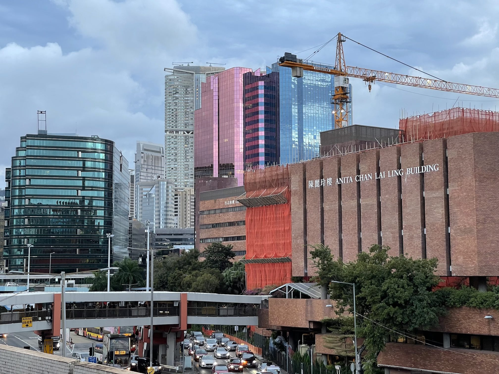
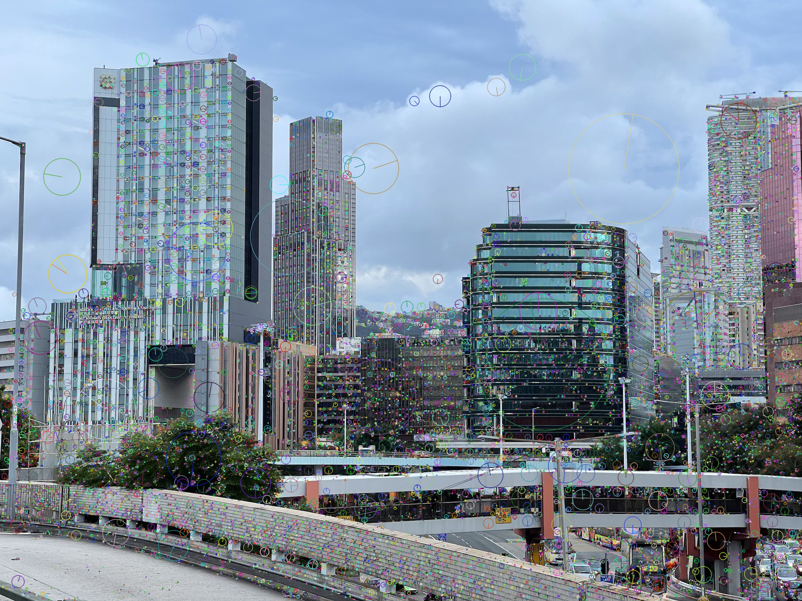
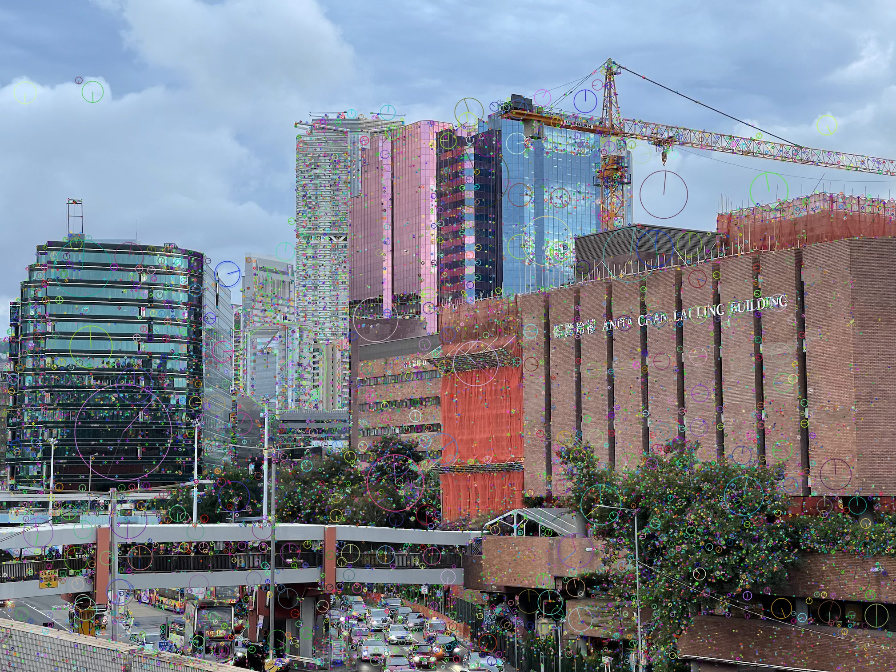
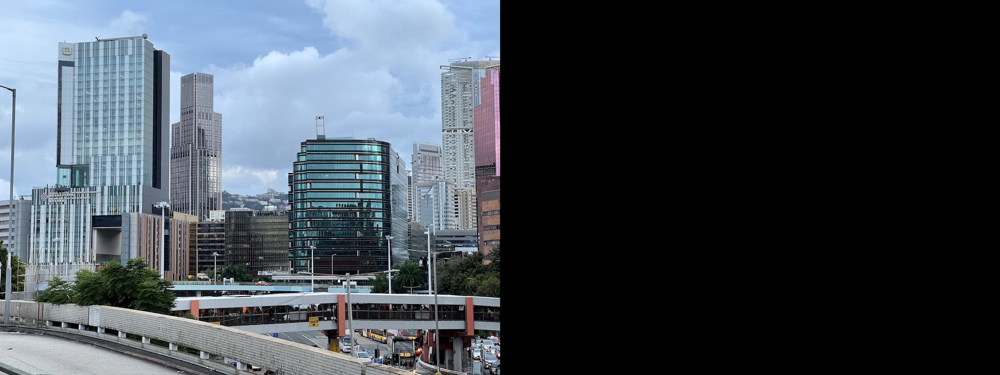
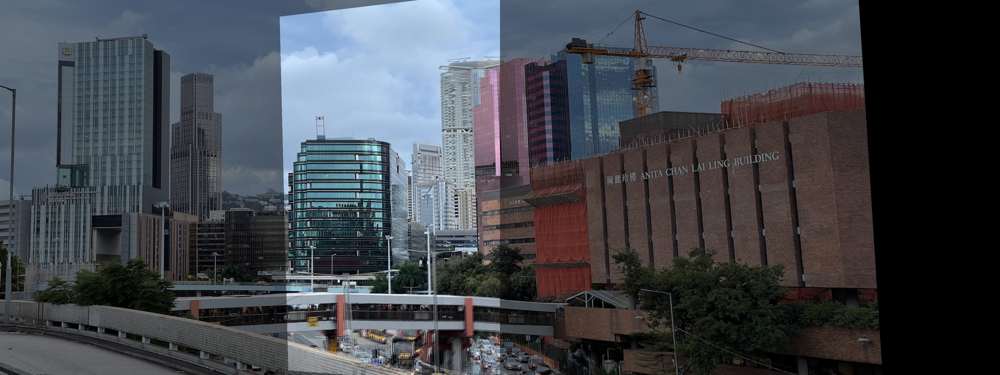
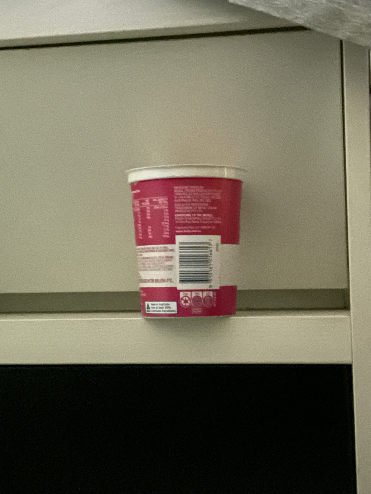
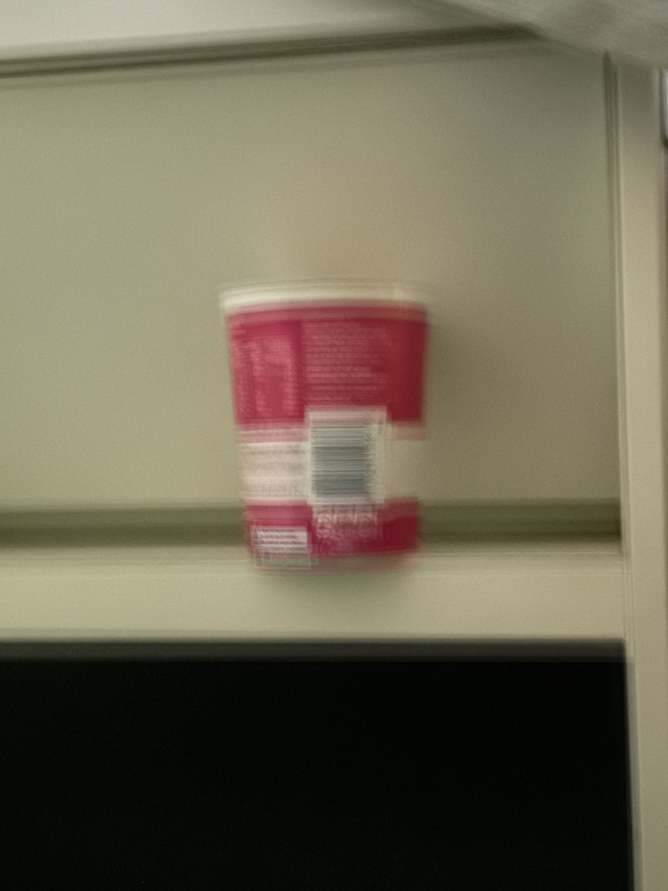
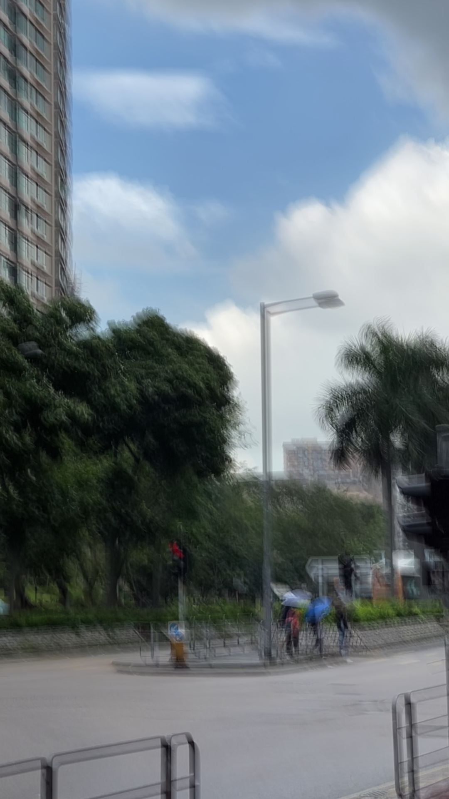
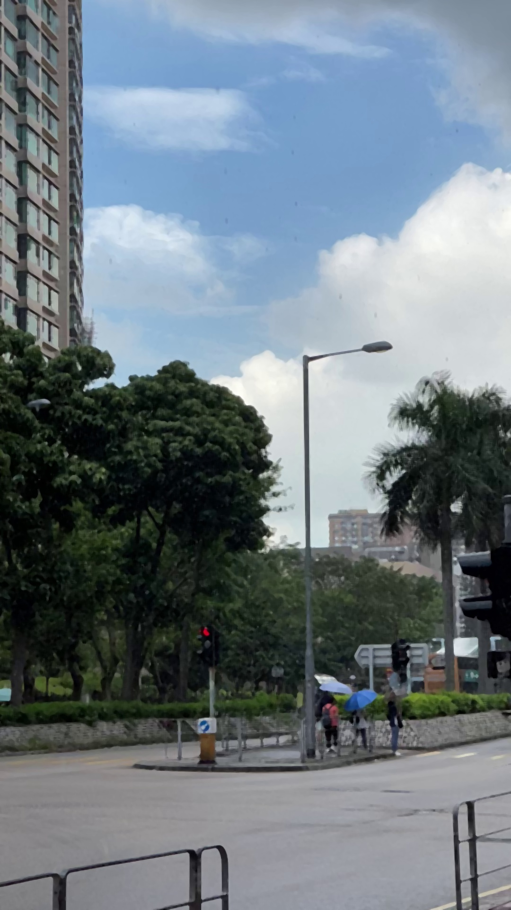
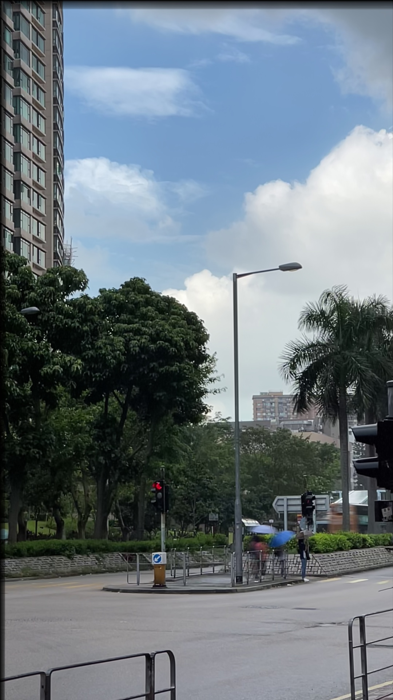

# Install OpenCV
The OpenCV library (Open Source Computer Vision Library) is a powerful library designed for computer vision process. This library can be used across different platforms and is freely available under the open-source Apache 2 License. It is written in C++ but it also provides a Python interface. In this tutorial, we will use various build-in functions provided by OpenCV to detect, match keypoints and transform images.

## On Windows
Please open your Anaconda propmt from the Start menu.
<center>
    
</center>

Create a new python environment with `opencv-python 4.5`, `tqdm`, and `ipython` by executing the following command.
```sh
(base) C:\Users\%USERNAME%> conda create --name opencv -c conda-forge opencv=4.5 tqdm ipython
```
Test your installation, check the OpenCV version which should be something similar to `4.5.x`.
```sh
(base) C:\Users\%USERNAME%> conda activate opencv
(opencv) C:\Users\%USERNAME%> python -c "import cv2; print(cv2.__version__)"
4.5.3
```
Each time you open the Anaconda propmt, you need to activate this environment in order to use OpenCV.

```sh
(base) C:\Users\%USERNAME%> conda activate opencv
(opencv) C:\Users\%USERNAME%> conda activate opencv
```

The newly created environment is can be found at `C:\Users\%USERNAME%\anaconda3\envs\opencv`. If you are using PyCharm, remember to set your project interpreter as demonstrated in the `SetupPython.html` file from the previous Lab tutorial.

```sh
# set project interpreter of PyCharm to
C:\Users\%USERNAME%\anaconda3\envs\opencv\python.exe
```

## On macOS
Open your Terminal app and create a new python environment with `opencv-python 4.5`, `tqdm`, and `ipython` by executing the following command.

```sh
$ conda create --name opencv -c conda-forge opencv=4.5 tqdm ipython
```

Test your installation, check the OpenCV version which should be something similar to `4.5.x`.

```sh
$ conda activate opencv
$ python -c "import cv2; print(cv2.__version__)"
4.5.3
```

Each time you open the Anaconda propmt, you need to activate this environment before using OpenCV.

```sh
$ conda activate opencv
```

The newly created environment is can be found at `/Users/USERNAME/miniconda3/envs/opencv`. If you are using PyCharm, remember to set your project interpreter as shown in `SetupPython.html` file from the previous Lab tutorial.

```sh
# set project interpreter of PyCharm to
/Users/USERNAME/miniconda3/envs/opencv/bin/python
```

# Read/save/show images in OpenCV
OpenCV offers a set of APIs to make it easy for us to read, write and display images.

## Read images
The `cv2.imread` function reads an image and returns it as an `np.ndarray` object with a data type of `np.uint8`, i.e., 8-bit unsigned integer.

```python
import cv2
import numpy as np

img = cv2.imread('image/md/left.jpg')
type(img)   # np.ndarray
img.shape   # (1512, 2016, 3) [H, W, C] of the image
img.dtype   # dtype('uint8')
```

You had better convert it to floating types before further processing to avoid any possible overflow.
```python
img = np.float32(img)
```

## Save images
The function `cv2.imwrite` takes an `np.ndarray` object as input and save it to a file. If the `dtype` of the array is not `np.uint8`, the function will automatically convert it to `np.uint8` before saving.

```python
cv2.imwrite('tmp.jpg', img) # return True, if write successfully.
```

## Show images
The `cv2.imshow` function is used to display an image. The function `cv2.waitKey` allows users to display a window for given milliseconds or until any key is pressed.

```python
cv2.imshow("window title", img)
cv2.waitKey(1000) # show the image for 1 seconds before it automatically closes
cv2.waitKey(0) # the window would wait till any key is pressed
```

To close all windows, you can use the `cv2.destroyAllWindows` function. Additionally, calling `cv2.waitKey` is necessary to allow OpenCV to update the windows.

```python
cv2.destroyAllWindows()
cv2.waitKey(1)
```

## Some utilities
Convenient utility functions for reading, writing, and displaying images are available in the `code/utils.py` file.

```python
from utils import imread, imshow, write_and_show, destroyAllWindows

img = imread('image/md/left.jpg')

imshow('tmp.jpg', img)

write_and_show('tmp.jpg',img)

# give you some time to view all windows before close
destroyAllWindows()  

# close immediately
destroyAllWindows(wait_key=False)
```

# A brief history of keypoints detection

This brief history and review is summarised by OpenCV-Python tutorials^[[Feature Detection and Description -- OpenCV-Python Tutorials beta documentation](https://opencv24-python-tutorials.readthedocs.io/en/latest/py_tutorials/py_feature2d/py_table_of_contents_feature2d/py_table_of_contents_feature2d.html)].

1. Harris Corner Detection:^[Harris, C., & Stephens, M. (1988, August). A combined corner and edge detector. In Alvey vision conference (Vol. 15, No. 50, pp. 10-5244).]

    In 1988, Chris Harris and Mike Stephens introduced the Harris Corner Detector in their paper titled 'A Combined Corner and Edge Detector'. This method was an early attempt to identify corners in images.

2. SIFT (Scale-Invariant Feature Transform):^[Lowe, D. G. (2004). Distinctive image features from scale-invariant keypoints. International journal of computer vision, 60(2), 91-110.]
   
    The Harris corner detector is not reliable when the scale of an image changes. So, in 2004, D.Lowe introduced a significant method called Scale-Invariant Feature Transform (SIFT) to overcome this limitation.

3. SURF (Speeded-Up Robust Features):^[Bay, H., Tuytelaars, T., & Van Gool, L. (2006, May). Surf: Speeded up robust features. In European conference on computer vision (pp. 404-417). Springer, Berlin, Heidelberg.]

    SIFT is known for its accuracy, but it may not be fast enough for some applications. In 2006, Bay, H., Tuytelaars, T. and Van Gool, L, and Van Gool, L. proposed a faster alternative called SURF. As name suggests, it is a speeded-up version of SIFT.

4. ORB (Oriented FAST and Rotated BRIEF):^[Rublee, E., Rabaud, V., Konolige, K., & Bradski, G. (2011, November). ORB: An efficient alternative to SIFT or SURF. In 2011 International conference on computer vision (pp. 2564-2571). IEEE.]

    This algorithm was introduced by  Ethan Rublee, Vincent Rabaud, Kurt Konolige, and Gary R. Bradski in their paper titled 'ORB: An efficient alternative to SIFT or SURF' in 2011. As the title says, it is a good alternative to SIFT and SURF in computation cost, matching performance. Unlike SIFT and SURF, which require payment for their usage due to patent restrictions, ORB is free from any such limitations.

In summary, Harris is one of the earliest corner detection algorithms and contains the basic idea for corner detection. SIFT is the first mature algorithm, although it is slower. SURF is a speeded-up version of SIFT. ORB, on the other hand, is a free alternative to both SIFT and SURF.

However, as of March 2020, the patent for SIFT has expired. This means that SIFT is now free to use. On the other hand, the patent for SURF is still valid at the moment.

# Image alignment via SIFT
In this section, we are going to detect keypoints in two images via the classic SIFT detector, find the corresponding keypoints, calculate the transformation and then align the two images. OpenCV also has APIs for other keypoint detection alogrithm, so once you are familiar with aligning images using SIFT, you can easily explore and test other keypoint detection algorithms as well.

1. Detect keypoints and generate keypoint descriptors.
3. Match the detected keypoints between two images.
4. Align the two images and stitch them together into one.

Here are the two example images and the final stitching result:

<center>



<p>Fig 1. (a) image 1. (b) image 2. (c) stitching result.</p>
</center>

## Detect keypoints and generate descriptors
Firstly, it is important to ensure that the images we are working with have a data type of `np.uint8`. We can then proceed to convert them to grayscale since all keypoint detectors in OpenCV can only handle single-channel images. To process colored images, we have two options: either convert them to grayscale or perform detection on each channel individually.

```python
img = imread('image/md/left.jpg')

img = np.uint8(img) # make sure it's np.uint8

img_gray = cv2.cvtColor(img, cv2.COLOR_BGR2GRAY) # to Gray Scale
```

Next, we detect keypoints in images and generate descriptors for those keypoints via SIFT.

```python
# SIFT
sift = cv2.SIFT_create()
keypoints, descriptors = sift.detectAndCompute(img_gray, mask=None)
```

If `N` keypoints are detected, the return values will have the following structure:

- `keypoints` is a list containing N `cv2.KeyPoint` objects. Each keypoint object has the following attributes:
    - `angle`: indicates the orientation of the descriptor.
    - `pt`: represents the location of the keypoint in the form of a tuple `(x,y)`.
    - `response`: signifies the keypoint response, where a higher value suggests a higher likelihood of being a keypoint. For SIFT, this is the Difference of Gauss（DoG）response.
    - `size`: denotes the scale of the keypoint.


```python
>>> from pprint import pprint
>>> type(keypoints)
list
>>> p = keypoints[0]
>>> pprint({name: p.__getattribute__(name) for name in dir(p) if not name.startswith('__')})
# You shall see something like this
{'angle': 83.27447509765625,
 ...,
 'pt': (2.505418539047241, 1013.8984375),
 'response': 0.01711214892566204,
 'size': 2.132431745529175}
```

- `descriptors` is an `np.array` of size `(N, 128)`. Each row stores an 128-dimensional descriptor for the corresponding keypoint.

```python
>>> descriptors
array([[  3.,   9.,  17., ...,   4.,   2.,   4.],
       [ 39.,   5.,   7., ...,   0.,   1.,   6.],
       [  0.,   0.,   0., ...,  15.,  12.,  11.],
       ...,
       [ 30.,  52.,   4., ...,   0.,   2.,  13.],
       [  0.,   0.,   0., ...,   4.,   2., 136.],
       [ 50., 131.,  30., ...,   0.,   0.,   0.]], dtype=float32)
```

To draw the detected keypoints on images, we use the `cv2.drawKeypoints` function. By passing the `cv2.DRAW_MATCHES_FLAGS_DRAW_RICH_KEYPOINTS` flag as a parameter, the function will display not only the location but also the size and orientation of the keypoints.

```python
# draw keypoints
img_keypoints = cv2.drawKeypoints(
        image     = img,
        keypoints = keypoints,
        outImage  = None,
        flags     = cv2.DRAW_MATCHES_FLAGS_DRAW_RICH_KEYPOINTS)

write_and_show('results/img_keypoints.jpg', img_keypoints)
```

Here are the detection results for the two example images:

<center>
<a href="image/md/left_keypoints.jpg">

</a>
&nbsp;&nbsp;
<a href="image/md/right_keypoints.jpg">

</a>
<p>Fig 2. Keypoints detected.</p>
</center>

## Matching
Let's assume that we have detected keypoints in both image 1 and image 2 and generated their descriptors using the following syntax:

```python
sift = cv2.SIFT_create()
keypoints1, descriptors1 = sift.detectAndCompute(img1_gray, None)
keypoints2, descriptors2 = sift.detectAndCompute(img2_gray, None)
```
The next step is to match keypoints between two images. This is done by finding keypoint pairs from two images with similar descriptors. The descriptor describes what the area around a keypoint looks like. Similar descriptors indicate similar patterns. The similarity of descriptors is measured by their euclidean distance. Assume we have two 128-dimensional keypoint descriptors $u,v\in\mathbb{R}^{128}$, their distance is defined as
$$d(u,v) = \sqrt{\sum_{i=1}^{128}(u_i-v_i)^2}$$
Small $d(u,v)$ value indicates that keypoint $u$ and $v$ looks similar. In the matching process, for each keypoint in image 1, we always match it with the most similar keypoint from image 2.

### Brute-force matcher
The matching process can be performed using the function `cv2.BFMatcher` in OpenCV:

```python
# create matcher
matcher = cv2.BFMatcher_create(crossCheck=True)

# get match
match = matcher.match(
            queryDescriptors = descriptors1,    # query
            trainDescriptors = descriptors2)    # train
# Docstring:
# match(queryDescriptors, trainDescriptors[, mask]) -> matches
# .   @brief Finds the best match for each descriptor from a query set.
```

The returned valure `match` is a list of `cv2.DMatch` objects, each with the following attributes:

- `distance`: Euclidean distance between two matched keypoints, calculated using the formula mentioned above..
- `queryIdx`: Index of the matched keypoints in __image 1__.
- `trainIdx`: Index of the matched keypoints in __image 2__.

```python
>>> type(match)
list
>>> m = match[0]
>>> pprint({name: m.__getattribute__(name) for name in dir(m) if not name.startswith('__')})
{'distance': 236.065673828125,
 ...,
 'queryIdx': 1,
 'trainIdx': 17140}
```

### FLANN based matcher
"BFMatcher" stands for "Brute-Forch Matcher". THe Brute-Force matcher is a simple matching algorithm that compares the descriptorss in the first set with all the features in the second set based on distance calculation. The closest match is returned as the result.

However, the BFMatcher algorithm is known to be slow. As an alternative, Fast Library for Approximate Nearest Neighbors (FLANN) is available. FLANN is a fast version of BFMatcher. Its usage is similar to BFMatcher but it offers improved speed.

```python
# create macher
matcher = cv2.FlannBasedMatcher_create()

# get match
match = matcher.match(
            queryDescriptors = descriptors1,    # query
            trainDescriptors = descriptors2)    # train
```

### Lowe's ratio test
In some cases, the matching result may contain a significant number of false matches. To mitigate this issue, we can employ the ratio test as described in Lowe's paper. In Lowe's ratio test, each keypoint from the first image is matched with a certain number of keypoints (e.g. the two best keypoints) from the second image. If the two matched distances are not sufficiently different, the keypoint is eliminated and not utilized for subsequent calculations.

```python
matcher = cv2.FlannBasedMatcher_create()

# get best two matches
best_2 = matcher.knnMatch(
            queryDescriptors = descriptors1,
            trainDescriptors = descriptors2,
            k                = 2)

# Lowe's ratio test
ratio = 0.7
match = []
for m,n in best_2:
    if m.distance < ratio*n.distance:
        match.append(m)
```

### Select good matches

`distance` measures goodness of the match. We only select the match with small `distance`, and remove those with large distance.
```python
# sort by distance
match = sorted(match, key = lambda x:x.distance)

# take the best 100 matches
match = match[:100]
```

### Draw match
We can visualize all matching keypoints using the `cv2.drawMatches` function.
```python
match_draw = cv2.drawMatches(
        img1        = img1,
        keypoints1  = keypoints1,
        img2        = img2,
        keypoints2  = keypoints2,
        matches1to2 = match,
        outImg      = None,
        flags       = cv2.DrawMatchesFlags_NOT_DRAW_SINGLE_POINTS)

```
<center>
<a href="image/md/match.jpg">

</a>
<p>Fig 3. Matched keypoints.</p>
</center>

## Stich images
The final step is to stitch the images together into a single larger image. To do this, we first need to obtain the coordinates of all the matched keypoints.

```python
# get coordinates of matched pairs
keypoints1 = np.array([keypoints1[m.queryIdx].pt for m in match])
keypoints2 = np.array([keypoints2[m.trainIdx].pt for m in match])
```

### Perspective transform
To ensure that both Image 1 and Image 2 are in the same coordinate system, we need to perform a perspective transform. This involves calculating a transformation matrix based on the corresponding keypoints between the two images, and then applying this transformation to Image 2.

Hereafter, we refer image 2 as __source image__ and image 1 as __destination image__. Calculate a perspective transform from source to destination image:
```python
src, dst = img2, img1
src_kps, dst_kps = (keypoints2, keypoints1)

T, status = cv2.findHomography(
                    srcPoints = src_kps,
                    dstPoints = dst_kps,
                    method    = cv2.USAC_ACCURATE,
                    ransacReprojThreshold = 3)
```
Not all matched keypoint pairs are correct. Incorrect matches can result in an inaccurate transformation. . To determine if a match is accurate or not, we can check if the pairs are sufficiently close after transformation. This is precisely what the `cv2.USAC_ACCURATE` method accomplishes. The `ransacReprojThreshold` parameter represents the maximum allowable projection error for considering a point pair as correct. In the provided code, the maximum allowed projection error is set to 3 pixels.

The return value `status` indicates the correctness of keypoints. `status[i]==1` means that `src_kps[i]` and `dst_kps[i]` are considered a correct pair.

The return value `T` is a $3\times3$ transformation matrix
$$\begin{equation}
T = \begin{bmatrix}
h_{11} & h_{12} & h_{13} \\
h_{21} & h_{22} & h_{23} \\
h_{31} & h_{32} & h_{33} \\
\end{bmatrix},
\end{equation}$$
which transforms a point at $(x,y)$ to location $(x', y')$:
$$\begin{equation}
\left\{
\begin{matrix}
x' =\dfrac{h_{11}x + h_{12}y + h_{13}}{h_{31}x + h_{32}y + h_{33}}\\
y' =\dfrac{h_{21}x + h_{22}y + h_{23}}{h_{31}x + h_{32}y + h_{33}}
\end{matrix} \right.
\end{equation}$$

We can utilize the `cv2.warpPerspective` function to apply the transformation `T` to image 2.

```python
H, W, _ = img2.shape
W = W*2

new_img2 = cv2.warpPerspective(
                    src   = img2,
                    M     = T,
                    dsize = (W, H),
                    dst   = np.zeros_like(img2, shape=(H,W)),
                    borderMode = cv2.BORDER_TRANSPARENT)
```
The parameter `dsize` is used to specify the size of the transformed image.


<center>
<a href="image/md/new_img2.jpg">

</a>
<p>Fig 3. transformed image 2.</p>
<a href="image/md/new_img1.jpg">

</a>
<p>Fig 4. resized image 1.</p>
</center>


Additionally, we need to pad image 1 with zeros to ensure that it has the same dimensions as the transformed image 2.

```python
# resize img1
new_img1 = np.hstack([img1, np.zeros_like(img1)])
```

### Stack two image together

The final step is to combine or stack these images together. By directly averaging them, we obtain the following result.

```python
direct_mean = new_img1/2 + new_img2/2
imshow('direct_mean.jpg', direct_mean)
```
<center>
<a href="image/md/direct_mean.jpg">

</a>
<p>Fig 5. Direct mean.</p>
</center>

To take the average only for the overlapped part, and copy the pixel values from either Image 1 or Image 2 for the unoverlapped part, you can accomplish this using the following code snippet:

```python
# smart average
cnt = np.zeros([H,W,1]) + 1e-10     # add a tiny value to avoid ZeroDivisionError
cnt += (new_img2 != 0).any(2, keepdims=True) # any: or
cnt += (new_img1 != 0).any(2, keepdims=True)

# convert to floating number to avoid overflow
new_img1 = np.float32(new_img1)
new_img2 = np.float32(new_img2)

stack = (new_img2+new_img1)/cnt
imshow('stack.jpg', stack)
```
`cnt` counts  the number of images that have a valid pixel value at location `(i,j)`:

- `cnt[i,j]` is 2, for overlapped part.
- `cnt[i,j]` is 1, if only one image have a valid pixel at `(i,j)`.
- `cnt[i,j]` is 0, if no image have a valid pixel at `(i,j)`.

<center>
<a href="image/md/stack.jpg">

</a>
<p>Fig 5. Smart average.</p>
</center>

# Panorama stitching
Last section introduces how to stitch two images into one single large image. This section will cover how to stitch together image frames from a video to create a panorama. To start, you need to read all frames from the `image/Vcore.mov` video. The function `read_video_frames` provided in `code/utils.py` can be used for this purpose.

```python
from utils import read_video_frames

video_name = 'image/Vcore.mov'
images, fps = read_video_frames(video_name)
```

In the case of a panorama, its dimensions are typically several times larger than those of video frames. For this video, we let `(H, W) = (h*4, w*3)`.

```python
h, w = images[0].shape[:2]
H, W = h*4, w*3
panorama = np.zeros([H,W,3]) # use a large canvas
```

Next, we initialize our panorama by placing the first frame to the canvas. For this video, since V Core is scanned from its bottom right corner, so we place first frame at the bottom right corner of the canvas.

```python
# init panorama
h_start = H-h-h//2
w_start = W-w
panorama[h_start:h_start+h, w_start:w_start+w, :] = images[0]
```
Next, we align all frames to the initial panorama one by one, similar to what was done in the previous section. We will also keep track of a `cnt` variable to record the count for each pixel and a `sum` variable to record the sum. To reduce computation, we can only stitch every forth or sixth frames.
```python
trans_sum = np.zeros([H,W,3])
cnt = np.ones([H,W,1])*1e-10
for img in tqdm(images[::4], 'processing'):  # tqdm for showing the progress; Lst[ Initial : End : IndexJump ]
    # TODO: write your own code here as last section
    #       to align img with current panorama
    aligned_img = ...

    # combine
    trans_sum += aligned_img
    cnt += (aligned_img != 0).any(2, keepdims=True)
    panorama = trans_sum/cnt

    # show
    imshow('panorama.jpg', panorama)
```

<center>


<p>Fig 6. From left to right: initial panorama; stitching half of frames; stitching all frames.</p>
</center>

# Video stabilization and stack denoising
Sometimes, the images we capture may contain a significant amount of random noise, particularly in low light conditions. One of the most commonly observed types of noise is known as white noise, which is depicted in the image below.
<center>
<table>
  <tr>
    <td></td>
    <td style="vertical-align: middle;">=</td>
    <td></td>
    <td style="vertical-align: middle;">+</td>
    <td></td>
  </tr>
</table>
<p>Fig 7. noisy image = scene + noise</p>
</center>

A noisy image can be seen as a combination of both the scene and noise components. One approach to reducing noise is capturing multiple images or frames of the same scene and then combining them to obtain a clear image. Let's assume we have $n$ images or frames captured for the same scene.

$$
\begin{matrix}
\text{img}_1 = \text{scene} + \text{noise}_1 \\
\text{img}_2 = \text{scene} + \text{noise}_2 \\
\vdots\\
\text{img}_n = \text{scene} + \text{noise}_4 \\
\end{matrix}
$$

By averaging all the images together, the scene itself will be preserved, while the noises will be smoothed.

$$\begin{align*}
\frac{1}{N}\sum_i \text{img}_i
                    &= \text{scene} + \frac{1}{N}\sum_i \text{noise}_i \\
                    &\approx \text{scene}
\end{align*}$$

This is the basic idea of stack denoising. Ideally, if all the scene images are perfectly aligned, the final image will exhibit good performance. However, in reality, the multiple images are often captured from slightly different locations or perspectives. The video may also lack stability, resulting in blurry images when directly stacked.
To address this issue, we need to perform two steps in the procedure:
1. Aligning the images (algorithm stabilization).
2. Average the aligned imaged to generate the final denoised image.

If you prefer not to carry a heavy tripod with you at all times, algorithmic stabilization can serve as a viable alternative.

<center>

<p>Tripod</p>
</center>

## Long exposure
The first example involves long exposure, which is suitable for capturing dark scenes. However, there are situations where long exposure alone may not be sufficient, particularly in extremely dark environments. In such cases, we can capture multiple images of the same scene and combine them to obtain a clearer image.
The image on the far right side below is a composite of 10 images. Each of these images was captured with an exposure time of 3 seconds. Therefore, the final stacked image effectively represents a cumulative exposure time of 30 seconds.
<center>
<a href="image/md/night.jpg">
</a>
<a href="image/night/0.jpg">
</a>
<a href="image/md/night_mean.jpg">
</a>
<a href="image/md/night_stabilized_mean.jpg">
</a>
<figcaption>Fig 6. From left to right: (a) no long exposure. (b) 3s long exposure. <br/> (c) stack 10 long-exposure images without stabilization. <br/> (d) stack 10 long-exposure images after stabilization.</figcaption>
</center>

## Deraining

Stack denoising can also be use to remove rain drops, if we consider rain drops as a kind of noise. It can produce a better result than applying the median filter. Although the median filter is a single-image deraining technique, it has a drawback of blurring the image. Stack denoising overcomes this limitation by producing a clear, rain-free outcome. However, it requires multiple images as input. The following figures depict the comparison between the results obtained using the median filter and stack denoising.

<center>
<a href="image/md/frame0.jpg">
</a>
<a href="image/md/mean.jpg">
</a>
<figcaption>Fig 7. (a) rainy image. (b) average without stabilization. </figcaption>

<a href="image/md/median.jpg">
</a>
<a href="image/md/stabilized_mean.jpg">
</a>
<figcaption>Fig 7. (c) median filter. (d) average after stabilization (stack denoising). </figcaption>
</center>

# Assignment (12 points + 2 bonus points)

## Image alignment via SIFT (8 points)
You are tasked with implementing keypoint detection and matching using the SIFT algorithm on the provided images `image/left2.jpg` and `image/right2.jpg`. To accomplish this, apply the following steps in `code/sift.py`.

1. Begin by reading in the two images, referring to them as `img1` and `img2` respectively.
2. Convert both images to grayscale.
3. Utilize the SIFT algorithm to detect keypoints in both images, draw these keypoints on the images, and save the results as `results/1.3_img1_keypoints.jpg` and `results/1.3_img2_keypoints.jpg`. (2 points)
4. Implement the keypoint matching process between the two images. Save the visualized match results as `results/1.4_match.jpg`.This process should encompass the keypoint matching and Lowe's ratio test to consolidate accurate matches. (2 points: 1 for matching, 1 for Lowe's ratio test)
5. Utilize the `cv2.findHomography` function to derive the transformation matrix from `img2` to `img1`. Print the transformation matrix and manually copy it into a file named `results/1.5_tf_matrix.pdf`. (1 point)
6. Apply the derived transformation matrix to `img2`, and save the transformed result as `results/1.6_transformed.jpg`. (1 point)
7. Combine the aligned images into a stacked image and save it as `results/1.7_stack.jpg`. (2 point)

## Creating a Panorama from a Video (4 points)
The second task is to stitch together all the frames from the video `image/winter_day.mov` into a panorama. To accomplish this, please complete the `code/panorama.py` file.

Steps:

1. Read in all the frames of the video `image/winter_day.mov`. Initialize the panorama with proper size and put the first frame of the video in proper position. (1 point)
2. Implement a frame alignment process to align each frame to the current panorama. Calculate the average of the current frame and the current panorama to update the panorama. (2 point)
4. Save the intermediate panorama image to a panorama list and in the end store this list in an MP4 file titled `results/2.3_panorama_list.mp4`. (0.5 points)
3. Save the final panorama image as `results/2.4_panorama.jpg`. (0.5 points)

## Stabilizing Rainy Videos to Create Rain-free Images (2 bonus points)
The third task involves stabilizing the video `image/rain2.MOV`to create a rain-free image by stacking all the frames together. To complete this task, please follow the steps below using the `code/derain.py` file:

Task steps:

1. Begin by reading in all frames of the video `image/rain2.MOV`. Then, complete the function `orb_keypoint_match()` to effectively find and match keypoints. (0.5 point)
2. Implement a video stabilization process by aligning all frames with the first frame. Save the stabilized video as `results/3.2_stabilized.mp4`. Tip: Utilize the `write_frames_to_video` function in `code/utils.py`, which can aid in saving a list of frames to a video. (1.0 point)
3. Utilize the stabilized frames to calculate the average, creating a single composite image. Save the resulting image as `results/3.3_stabilized_mean.jpg`. Please note that the moving car might introduce some blurriness in that area, which can be disregarded. (0.5 point)
<!-- 4. Repeat the aforementioned process on the video `image/rain3.mp4`, save the corresponding results as `results/3.4_stabilized.mp4`  (stabilized video)  and `results/3.5_stabilized_mean.jpg` (average stabilized image). Keep in mind that parameter adjustments may be necessary to achieve optimal results.(0.5 point)
``` -->

## Submission instruction

To ensure a successful submission, please include the following components:

1. Intermediate Results: Include all intermediate results specified to be saved (`results/*.jpg`, `results/*.pdf`).
2. Source Code: Provide all source code (located in `code/*.py`)  that can effectively reproduce your results.
3. File Size Considerations: If the file size of the results is too large to upload directly to BlackBoard, you may alternatively provide an external link. It is essential to ensure that the tutor can download the files successfully through the provided link.

Additionally, note that the usage of `cv2.createStitcher` and `cv2.Stitcher_create` is not permitted for this assignment.

The deadline for submission is __23:59 on Nov 24 (Thursday)__. Multiple submissions are allowed, but only the latest submission will be graded.

# References {-}
